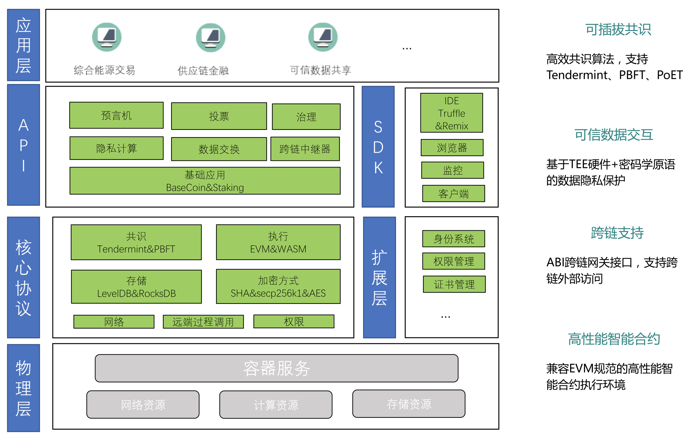
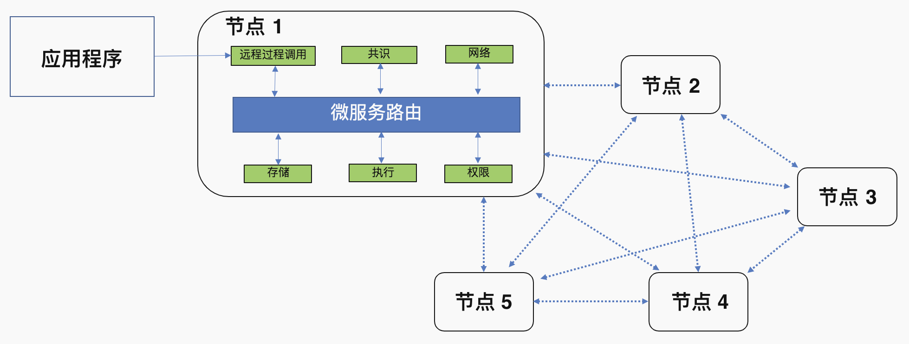

## YeezChain介绍
YeezChain是由熠智科技研发的自主可控区块链底层平台，由模块化架构支撑，并具备极佳的隐私性、可伸缩性、灵活性和可扩展性，能有效支撑企业、政府、产业联盟等行业的分布式账本应用。

对于初次接触区块链技术的人员，推荐首先阅读下文中的简介，以便于理解区块链的工作原理、YeezChain具有的主要特点以及包含的组件。

如果你已经对分布式账本和联盟链有所了解，可直接阅读我们的[YeezChain's Wiki](https://gitlab.com/Yeez/yeez_doc/-/wikis/YeezChain's-Wiki)，其包含相关示例、技术规格以及APIs等等。

## 区块链是什么？
区块链是分布式数据存储、点对点传输、共识机制、加密算法等计算机技术在互联网时代的创新应用模式。总的来说，区块链本质上是一个**去中心化**的分布式账本数据库，在这个账本中记录了区块链网络中发生的所有交易信息。从技术角度来说，区块链并不是一种单一的技术，而是多种技术整合的结果，包括了分布式账本、共识机制、智能合约等等。这些技术以新的结构组合在一起，形成了一种新的数据记录、存储和表达的方式。

### 分布式账本
区块链账本通常被定义为**去中心化**，这是因为在整个网络中，每个参与者都保存着一个区块链账本的副本，所有参与者通过**协作**共同维护着账本。除了去中心化与协作，区块链的另一个显著特点是信息在只能以“附加”的方式记录在区块链中，同时使用加密技术保障了交易一旦被添加进账本中，就无法被篡改。区块链的这种**不可篡改性**使得信息来源的确认变得异常容易，这是由于参与者可以肯定信息一旦被写入区块链中就几乎不可被篡改。

### 共识机制
共识是分布式系统中的基本性质之一，具体来说是指通过消息传递使得系统中所有节点均以相同顺序执行一个命令序列，而在实际环境中，节点可能出错产生异常行为，或者消息无法被正确传递，使得系统无法达成一致。区块链技术的出现让共识机制重新得到关注，在区块链网络中，共识机制实现了网络中所有账本交易的同步流程，共识保证了账本只会在交易双方都确认后才进行更新。同时在账本更新时，交易双方能够在账本中的相同位置，更新一个相同的交易信息。根据是否能够容忍节点的作恶行为，共识机制通常分为非拜占庭类共识和拜占庭容错共识。

在共识层面，YeezChain内置PBFT和Tendermint等多种共识机制，用户可根据应用场景进行选择。默认情况下，YeezChain采用Tendermint共识机制，它的创新之处在于，将区块链应用（状态）与底层共识进行了分离，将共识引擎和P2P网络层封装组成Tendermint Core。同时提供ABCI接口与应用层进行交互，应用逻辑可以用任何语言编写，应用做的事情实际上就是状态机控制。

### 智能合约
为了实现更复杂的逻辑操作，以及对账本进行管理，区块链网络引入了智能合约来实现对账本的访问和控制。智能合约是一套以数字形式定义的承诺，包括合约参与方可以在上面执行这些承诺的协议。一个合约由一组代码（合约的函数）和数据（合约的状态）组成，并且运行在区块链上。根据底层实现机制，区块链智能合约实现方式包括了Docker和轻量级虚拟机两种方式。

YeezChain采用EVM兼容的合约虚拟机，意味着以太坊的分布式应用可以轻松移植到YeezChain上，同时YeezChain的定制化虚拟机不受 gas Limit限制，因而在YeezChain上能够进一步扩展智能合约应用场景。同时YeezChain支持Truffle、Remix等主流智能合约开发部署工具，提供RPC JSON & REST调用接口，兼容Web3标准。

### 加密算法
区块链是建立与密码学算法之上的一种分布式记账本，从区块链底层数据结构到区块链交易，密码学算法都发挥着它的重要作用。区块链涉及的密码算法包括了哈希函数和非对称加密算法。哈希函数主要用于对传输信息进行完整性校验，保证数据的完整性。而非对称加密技术一般用于对身份识别和认证，主要是为了保证加密通信只有两个人看到并确认消息的发出者。

YeezChain提供对Secp256k哈希函数以及RSA和椭圆曲线加密算法的支持，除此之外也支持国密SM2/3/4等多种加密和签名算法。

### 隐私保护
在区块链中，所有数据(包括交易类别、交易 双方的地址、交易金额等)都是公开的，这在一定程度上提高了参与者对数据真实可靠的信心。大多数区块链系统会将所有交易数据记录在公共账本中，任何用户均可查询。但公开所有数据在某些关键应用场景下是不可行的，例如金融、医疗等数据敏感性高的场合。因此，区块链交易数据隐私保护的目的在于，满足区块链系统正常运行的前提下，选择合适的密码技术来实现交易数据的隐私保护。

在保证区块链去中心化和数据不可篡改特性的基础上，YeezChain提供了基于密码学的数据隐私保护方案。支持在智能合约中的隐私数据加密，同时可以支持加密数据的同态操作，并且可以提供基于单次交互的零知识证明解密结果范围证明。在[这里](https://github.com/longinus41/salary_demo)你可以查看一个简单的实现案例。在后续版本中，YeezChain将支持基于Interl SGX的可信计算硬件部署可信执行环境，实现智能合约对隐私数据的可信计算。

## YeezChain架构
至此，我们可以简单介绍YeezChain的架构设计。

YeezChain由下至上分为物理层、核心协议层/扩展层、API/SDK层和应用层。

> 物理层主要指基础设施（资源），包括计算资源、存储资源、网络资源以及虚拟化服务。

> 核心层主要由共识引擎、兼容以太坊虚拟机执行引擎以及API网关组成。共识引擎实现了拜占庭容错的高性能共识算法Tendermint。执行引擎完全兼容以太坊虚拟机。除此之外，执行引擎还支持跨平台、确定性语言WebAssembly。

> API网关提供了REST与JSON RPC的交互方式，可便捷地与查询链上数据的状态，并与链及链上应用交互。同时，API网关还支持websocket的订阅方式，可定制化地、高效地获取目标数据。

同时，YeezChain提供了一个独特的可伸缩、可扩展的架构，这也是YeezChain与其他区块链解决方案的显著区别。具体来说，YeezChain实现了微服务架构，各个组件（例如：存储、共识、执行、权限等）之间彼此独立，并通过微服务分发路由进行通信。每个组件可以不同的编程语言实现，完全去耦合、即插即用。

## 快速入门
这里设定了一个简单的YeezChain网络场景，包括单节点和多节点的区块链网络。

### 下载安装
* 安装go环境，下载[地址](https://golang.org/dl/)。配置go环境变量`$GOAPTH`，并配置至系统路径：
`export PATH=$GOPATH/bin:$PATH`
* 安装YeezChain二进制包yeez，以及Solidity编译器二进制包solc。下载[地址](http://39.100.141.7:8020/download/)。
* 将二进制包yeez以及solc拷贝至目录`$GOAPTH`。

### 部署
#### 单节点
配置并启动单节点链：
`yeez spec -p1 -f1 | yeez configure -s- | yeez start -c-`
上述启动命令可拆分为配置与运行三个部分：
* 初始化：`yeez spec --participant-accounts=1 --full-accounts=1 > genesis-spec.json`
* 配置：`yeez configure --genesis-spec=genesis-spec.json > yeez.toml`
* 运行：`yeez start --config=yeez.toml`

其中`yeez spec`会生成创世区块配置文件，初始化节点并分配节点权限。节点权限取决于节点类型，节点类型包括全类型节点、验证类型节点、根类型节点、开发者类型节点以及参与者类型节点。

#### 多节点网络
配置节点网络（两节点）：
`yeez spec -f2 | yeez configure -s- --pool`
启动节点网络：
`yeez start --config=yeez000.toml`
`yeez start --config=yeez001.toml`

### 发送交易
生成交易：
`yeez tx formulate send -s $SENDER -t $RECIPIENT -a $AMOUNT > tx.json`

其中`$SENDER`和`$RECIPENT`为发送方和接收方的地址，可以在配置文件`yeez.toml`中查看，`$AMOUNT`为交易金额。

提交交易：
`yeez tx commit --file tx.json`

### 部署智能合约
首先你需要一个基于Solidity的智能合约，以及对应的部署脚本。这里我们提供一个简单的[示例](http://39.100.141.7:8020/download/)，该示例实现了一个用户管理合约。

合约部署：
`yeez deploy --address $ADDRESS user.yaml`

这里`user.yaml`是示例中提供的部署脚本，而`$ADDRESS`则是部署者的地址，可以在配置文件`yeez.toml`中查看。执行成功后会生成文件`user.out.json`，其中包含了智能合约的地址，然后就可通过API网关与链上智能合约进行交互。

## 示例
用户管理系统，支持基本的添加、删除用户，修改用户数据，查询用户信息。
系统后端架构基于YeezChain，启动了三个YeezChain节点，实现了多方数据共享，并且分布式架构及全冗余数据极大提升了系统的可靠性；业务逻辑由链上智能合约实现，简化了业务管理流程。

YeezChain节点1: http://39.100.141.7:8010/  
YeezChain节点2: http://47.108.203.207:8010/  
YeezChain节点3: http://47.113.89.185:8010/

## 技术文档
更详细的技术文档请参考[YeezChain's Wiki](https://gitlab.com/Yeez/yeez_doc/-/wikis/YeezChain's-Wiki)。
